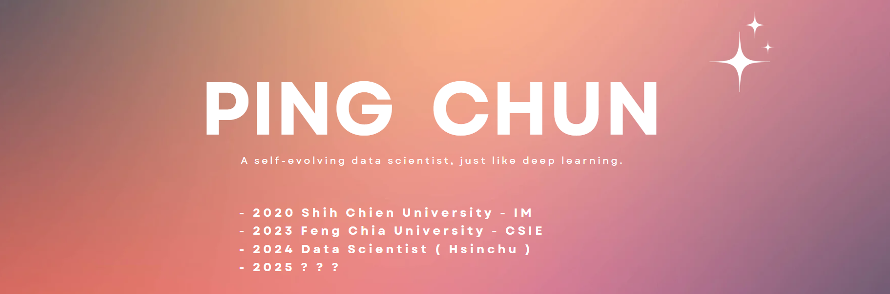

<!-- 
SOMETHING SOURCE
https://github.com/abhisheknaiidu/awesome-github-profile-readme
https://simpleicons.org/
https://emojipedia.org/bar-chart
https://icons8.com/icons
https://github.com/aleen42/badges
https://www.base64-image.de/
shields.io: https://shields.io/docs/logos
ASCII Art Generator: https://patorjk.com/software/taag/#p=display&f=BlurVision%20ASCII&t=PING%20CHUN
Font Name: Graffiti Larry 3D, Merlin1, Ogre, Calvin S, Cyberlarge, Isometric3, Slant, Lean, Kban,  JS Cursive
https://techstack-generator.vercel.app/
https://skillicons.dev/
https://github.com/tandpfun/skill-icons#readme
-->


<!-- shield.io -->
<div align="center">

[](https://visitor-badge.laobi.icu/badge?page_id=Junwu0615.Junwu0615)
[](https://pc-dashboard.streamlit.app/)
[](mailto:jun.audis5@gmail.com)

</div>


<!-- 

-->

<br>

<!-- Introduction
<p align="center">
    <a href="https://github.com/Junwu0615">
        
    </a>
</p>
<br>
-->


<!-- Languages -->
<div align="center">
    <table>
        <thead>
            <tr>
                <th colspan="10" align="center"> Languages </th>
            </tr>
        </thead>
        <tbody>
            <tr>
                <td align="center" style="border: none;">
                    <a href="https://www.python.org/">
                        
                    </a>
                    <br> Python
                </td>
                <td align="center" style="border: none;">
                    <a href="https://www.w3schools.com/c/c_intro.php">
                        
                    </a>
                    <br> C
                </td>
                <td align="center" style="border: none;">
                    <a href="https://zh.wikipedia.org/zh-tw/C%2B%2B">
                        
                    </a>
                    <br> C++
                </td>
                <td align="center" style="border: none;">
                    <a href="https://developer.mozilla.org/zh-TW/docs/Web/HTML">
                        
                    </a>
                    <br> HTML
                </td>
                <td align="center" style="border: none;">
                    <a href="https://developer.mozilla.org/zh-TW/docs/Web/CSS">
                        
                    </a>
                    <br> CSS
                </td>
                <td align="center" style="border: none;">
                    <a href="https://markdown.tw/">
                        
                    </a>
                    <br> Markdown
                </td>
                <td align="center" style="border: none;">
                    <a href="https://www.php.net/">
                        
                    </a>
                    <br> PHP
                </td>
            </tr>
        </tbody>
    </table>
</div>

<!-- Database -->
<div align="center">
    <table>
        <thead>
            <tr>
                <th colspan="10" align="center"> Database </th>
            </tr>
        </thead>
        <tbody>
            <tr>
                <td align="center" style="border: none;">
                    <a href="https://icons8.com/icons/set/sql-server">
                        
                    </a>
                    <br> SQL Server
                </td>
                <td align="center" style="border: none;">
                    <a href="https://www.postgresql.org/">
                        
                    </a>
                    <br> PostgreSQL
                </td>
                <td align="center" style="border: none;">
                    <a href="https://www.mysql.com/">
                        
                    </a>
                    <br> MySQL
                </td>
                <td align="center" style="border: none;">
                    <a href="https://icons8.com/icons/set/sqlite">
                        
                    </a>
                    <br> SQLite
                </td>
            </tr>
        </tbody>
    </table>
</div>

<!-- LLM & Machine Learning -->
<div align="center">
    <table>
        <thead>
            <tr>
                <th colspan="10" align="center"> LLM & Machine Learning </th>
            </tr>
        </thead>
        <tbody>
            <tr>
                <td align="center" style="border: none;">
                    <a href="https://chatgpt.com/" style="color: white;">
                        
                    </a>
                    <br> ChatGPT
                </td>
                <td align="center" style="border: none;">
                    <a href="https://gemini.google.com/?hl=zh-TW" style="color: white;">
                        
                    </a>
                    <br> Google Gemini
                </td>
                <td align="center" style="border: none;">
                    <a href="https://www.tensorflow.org/">
                        
                    </a>
                    <br> Tensorflow
                </td>
                <td align="center" style="border: none;">
                    <a href="https://icons8.com/icon/z2pN6mJXIC4u/keras">
                        
                    </a>
                    <br> Keras
                </td>
                <td align="center" style="border: none;">
                    <a href="https://pytorch.org/">
                        
                    </a>
                    <br> PyTorch
                </td>
            </tr>
        </tbody>
    </table>
</div>

<!-- Deploy & Cloud -->
<div align="center">
    <table>
        <thead>
            <tr>
                <th colspan="10" align="center"> Deploy & Cloud </th>
            </tr>
        </thead>
        <tbody>
            <tr>
                <td align="center" style="border: none;">
                    <a href="https://www.docker.com/">
                        
                    </a>
                    <br> Docker
                </td>
            </tr>
        </tbody>
    </table>
</div>

<!-- Skills -->
<div align="center">
    <table>
        <thead>
            <tr>
                <th colspan="10" align="center"> Skills </th>
            </tr>
        </thead>
        <tbody>
            <tr>
                <td align="center" style="border: none;">
                    <a href="https://numpy.org/">
                        
                    </a>
                    <br> NumPy
                </td>
                <td align="center" style="border: none;">
                    <a href="https://pandas.pydata.org/">
                        
                    </a>
                    <br> Pandas
                </td>
                <td align="center" style="border: none;">
                    <a href="https://flask.palletsprojects.com/">
                        
                    </a>
                    <br> Flask
                </td>
                <td align="center" style="border: none;">
                    <a href="https://fastapi.tiangolo.com/">
                        
                    </a>
                    <br> FastAPI
                </td>
                <td align="center" style="border: none;">
                    <a href="https://ngrok.com/">
                        
                    </a>
                    <br> NGROK
                </td>
            </tr>
            <tr>
                <td align="center" style="border: none;">
                    <a href="https://github.com/features/actions">
                        
                    </a>
                    <br> Github Actions
                </td>
                <td align="center" style="border: none;">
                    <a href="https://gist.github.com/">
                        
                    </a>
                    <br> Github Gist
                </td>
                <td align="center" style="border: none;">
                    <a href="https://airflow.apache.org/">
                        
                    </a>
                    <br> Apache Airflow
                </td>
                <td align="center" style="border: none;">
                    <a href="https://streamlit.io/">
                        
                    </a>
                    <br> Streamlit
                </td>
                <td align="center" style="border: none;">
                    <a href="https://www.wampserver.com/en/">
                        
                    </a>
                    <br> WampServer
                </td>
            </tr>
        </tbody>
    </table>
</div>

<!-- Message & Version Control -->
<div align="center">
    <table>
        <thead>
            <tr>
                <th colspan="4" align="center"> Message </th>
                <th colspan="2" align="center"> Version Control </th>
            </tr>
        </thead>
        <tbody>
            <tr>
                <td align="center" style="border: none;">
                    <a href="https://web.telegram.org/">
                        
                    </a>
                    <br> Telegram
                </td>
                <td align="center" style="border: none;">
                    <a href="https://www.line.me/tw/">
                        
                    </a>
                    <br> Line
                </td>
                <td align="center" style="border: none;">
                    <a href="https://aws.amazon.com/tw/what-is/mqtt/">
                        
                    </a>
                    <br> MQTT
                </td>
                <td align="center" style="border: none;">
                    <a href="https://developer.mozilla.org/zh-TW/docs/Web/API/WebSocket">
                        
                    </a>
                    <br> WebSocket
                </td>
                <td align="center" style="border: none;">
                    <a href="https://github.com/">
                        
                    </a>
                    <br> Git
                </td>
                <td align="center" style="border: none;">
                    <a href="https://github.com/">
                        
                    </a>
                    <br> Github
                </td>
            </tr>
        </tbody>
    </table>
</div>

<!-- IDE of Programming -->
<div align="center">
    <table>
        <thead>
            <tr>
                <th colspan="10" align="center"> IDE of Programming </th>
            </tr>
        </thead>
        <tbody>
            <tr>
                <td align="center" style="border: none;">
                    <a href="https://www.jetbrains.com/pycharm/">
                        
                    </a>
                    <br> PyCharm
                </td>
                <td align="center" style="border: none;">
                    <a>
                        
                    </a>
                    <br> Azure Data Studio
                </td>
                <td align="center" style="border: none;">
                    <a href="https://icons8.com/icon/F4uMFPZgS0gt/anaconda">
                        
                    </a>
                    <br> Anaconda
                </td>
                <td align="center" style="border: none;">
                    <a href="https://icons8.com/icons/set/jupyter">
                        
                    </a>
                    <br> Jupyter
                </td>
                <td align="center" style="border: none;">
                    <a href="https://icons8.com/icon/0S1Hoidfnk7H/spyder-ide-5">
                        
                    </a>
                    <br> Spyder
                </td>
                <td align="center" style="border: none;">
                    <a href="https://code.visualstudio.com/">
                        
                    </a>
                    <br> VS Code
                </td>
                <td align="center" style="border: none;">
                    <a href="https://visualstudio.microsoft.com/zh-hant/downloads/">
                        
                    </a>
                    <br> VS
                </td>
            </tr>
        </tbody>
    </table>
</div>

<!-- Operating System & Job Tools -->
<div align="center">
    <table>
        <thead>
            <tr>
                <th colspan="2" align="center"> Operating System </th>
                <th colspan="2" align="center"> Command Tools </th>
                <th colspan="3" align="center"> Job Tools </th>
            </tr>
        </thead>
        <tbody>
            <tr>
                <td align="center" style="border: none;">
                    <a href="https://www.microsoft.com/zh-tw/software-download/windows10">
                        
                    </a>
                    <br> Windows
                </td>
                <td align="center" style="border: none;">
                    <a href="https://www.linux.org/">
                        
                    </a>
                    <br> Linux
                </td>
                <td align="center" style="border: none;">
                    <a href="https://learn.microsoft.com/zh-tw/powershell/scripting/overview?view=powershell-7.5">
                        
                    </a>
                    <br> Powershell
                </td>
                <td align="center" style="border: none;">
                    <a href="https://learn.microsoft.com/zh-tw/windows-server/administration/windows-commands/cmd">
                        
                    </a>
                    <br> CMD
                </td>
                <td align="center" style="border: none;">
                    <a>
                        
                    </a>
                    <br> Copilot
                </td>
                <td align="center" style="border: none;">
                    <a>
                        
                    </a>
                    <br> Youtrack
                </td>
                <td align="center" style="border: none;">
                    <a href="https://icons8.com/icon/set/notion/group-ui">
                        
                    </a>
                    <br> Notion
                </td>
            </tr>
        </tbody>
    </table>
</div>

<!-- Base Tools -->
<div align="center">
    <table>
        <thead>
            <tr>
                <th colspan="10" align="center"> Base Tools </th>
            </tr>
        </thead>
        <tbody>
            <tr>
                <td align="center" style="border: none;">
                    <a href="https://icons8.com/icon/rZObyIJRui2T/adobe-acrobat">
                        
                    </a>
                    <br> Acrobat
                </td>
                <td align="center" style="border: none;">
                    <a href="https://www.adobe.com/tw/products/photoshop.html">
                        
                    </a>
                    <br> PS
                </td>
                <td align="center" style="border: none;">
                    <a href="https://www.adobe.com/tw/products/premiere.html">
                        
                    </a>
                    <br> PR
                </td>
                <td align="center" style="border: none;">
                    <a href="https://www.adobe.com/tw/products/aftereffects.html">
                        
                    </a>
                    <br> AE
                </td>
                <td align="center" style="border: none;">
                    <a href="https://icons8.com/icon/117563/microsoft-word-2019">
                        
                    </a>
                    <br> Word
                </td>
                <td align="center" style="border: none;">
                    <a href="https://icons8.com/icon/ifP93G7BXUhU/microsoft-powerpoint-2019">
                        
                    </a>
                    <br> PowerPoint
                </td>
                <td align="center" style="border: none;">
                    <a href="https://icons8.com/icon/117561/microsoft-excel-2019">
                        
                    </a>
                    <br> Excel
                </td>
            </tr>
        </tbody>
    </table>
</div>

<!-- Studying -->
<div align="center">
    <table>
        <thead>
            <tr>
                <th colspan="10" align="center"> Studying </th>
            </tr>
        </thead>
        <tbody>
            <tr>
                <td align="center" style="border: none;">
                    <a href="https://reactjs.org/" style="color: white;">
                        
                    </a>
                    <br> React
                </td>
                <td align="center" style="border: none;">
                    <a href="https://developer.mozilla.org/zh-TW/docs/Web/JavaScript" style="color: white;">
                        
                    </a>
                    <br> JavaScript
                </td>
                <td align="center" style="border: none;">
                    <a href="https://www.djangoproject.com/" style="color: white;">
                        
                    </a>
                    <br> Django
                </td>
                <td align="center" style="border: none;">
                    <a href="https://grafana.com/" style="color: white;">
                        
                    </a>
                    <br> Grafana
                </td>
                <td align="center" style="border: none;">
                    <a href="https://azure.microsoft.com/zh-tw" style="color: white;">
                        
                    </a>
                    <br> Azure
                </td>
                <td align="center" style="border: none;">
                    <a href="https://cloud.google.com" style="color: white;">
                        
                    </a>
                    <br> GCP
                </td>
                <td align="center" style="border: none;">
                    <a href="https://aws.amazon.com" style="color: white;">
                        
                    </a>
                    <br> AWS
                </td>
                <td align="center" style="border: none;">
                    <a href="https://kubernetes.io/" style="color: white;">
                        
                    </a>
                    <br> Kubernetes
                </td>
            </tr>
        </tbody>
    </table>
</div>


<!-- Greedy Snake: https://github.com/marketplace/actions/generate-snake-game-from-github-contribution-grid -->
<p align="center">
    <picture>
        <source media="(prefers-color-scheme: dark)" srcset="https://raw.githubusercontent.com/Junwu0615/Junwu0615/output/github-contribution-grid-snake-dark.svg">
        <source media="(prefers-color-scheme: light)" srcset="https://raw.githubusercontent.com/Junwu0615/Junwu0615/output/github-contribution-grid-snake.svg">
        
    </picture>
</p>


<!-- Trophy: https://github.com/ryo-ma/github-profile-trophy -->
<p align="center">
    
</p>

<br>

<!-- Open-Source Projects -->
<details open>
<summary> 🖥️ Open-Source Projects </summary>
<br>

<table width='1000' align="center">
<tr> <th> LLM </th> </tr>
<td>

<!-- LLM -->
| <div style='width: 230px'> Title </div> | <div style='width: 80px'> Clone </div> | <div style='width: 300px'> Technologies </div> |
|--|:--:|--|
| [PC-Bot-With-GenAI](https://github.com/Junwu0615/PC-Bot-With-GenAI) |  |   ![SQL_Server](https://img.shields.io/badge/SQL_Server-646565.svg?logo=data:image/jpeg;base64,iVBORw0KGgoAAAANSUhEUgAAADAAAAAwCAYAAABXAvmHAAAACXBIWXMAAAsTAAALEwEAmpwYAAAIR0lEQVR4nO1Ze4xUVxm/rdi09VFbtOzc75vZbB8byyqIWChQFAwpuLSJ1VqrtQVRq1Ex1Tb2LaZRqLykD1NbAxrTELqiUJg5Z/YBQ6EsUGfOuQuz95y551yW5S20vCmvwJjvziwZMf1zZ+cPfskkc889Z+Z7/r5zvuM4l3EZtQHPDxulto9KZVcKbfYXi8UrnFpHVvd8Vmo7T2pr6CO0fS1XsA8IbU9sDoJPOrWKbdt3DRfKbhcqPOip4BURBEMr3wttCp5vP+fUIqQ290tt9pGQQttjFC5S2/ekMh1S2/miYB6WyqwhTzi1iI1z5p6KQqdQAFJEKjMx6++ICW2/JpR5Wii7WShzQepwqVOLSA8bfqp15MhsEmC0p+1XpTZ7SSF6J1T43cgb2v6acqImE7lt2LDJHPFkCrGHIx5sHzVarn/s8SPvzFuQ37JilZXrO8fRPKlMFyno1CIY4r0MYG86kRjLXPeejubm5W2j78gyAMUAznKAD1qHDe9aO/372zniD1Ox2Lh21x3s1BKY605jiEHrkCEfo+fViMAB1nFEmQZoZwBvtjY1/ZYDLOaImzjAYQ5wiAPsYK47O404pQXxmoFVAmAJA3gljTiKA+zjiM9mHGdQKh7/EkcUffNSrtvIEP/JAI5wgNPcdV9giBkOcJTG0wDfbHGcj1RdgfabbrqOLMvi8RMMcXbL0KFX0Ximvv5qEm5VLHYtA5hLlmeIsxjiTIa4um99GvGGFMDDHHEzQ+xlAAvYLbdUtwCmAZZygHfJ4hzxGENMcoAfU6IzRMUB3uCJRIzmMsROjvidvrU8Hm9iAE9S6KUATnHEInPd3dx176+eAohTOOIa+p5MJK5niA9yAJ+EIcFYIhFV6TTAcAawJ1NfX8cAHuUA3RxxFwP4C4UQB3iaI7akASYyAEOhtSoW+3S/K9AWj7sMYH9ZmRs4YgcD2MYRNzCAX3LEHRxgRarkIcEQ36PcIWZyyuhoaBjCEQ+kY7GonlByM8QXGUAPAxjWrwrMcpwrGeK5NoBbyfLlP36LwihSynXv5gAnOeIFsmzrkCE3Vq4vOs4VHDFFOXLpbxMFEzn0uxIM4AxZkAM8lHbdeNnKzVEIAeQZwI40wI84wDJ6TtbV3XZRSICnOMCGD2MhygeqOcm6uvr+YyLE8xxgK4VFxPukEEBIf55EnMUBWi8qizgjsqrrjuAA32CIOxkA0jvyDgeYwF33JwxxEa0rs9NZjvh6vyjA4vG7GEBnCvHn5UJ1Ju26zxCVkpAM8T+XWo+YiJe89D5HXMgAVtK8ci1ZwxD/zOPxX3GAqRSaVFv6RfhIAYC/RlyPuIlRnLvuZmKWlYMHf4IhagZwH82jGpFsaJjEE4n50dwSbXaTpRniA+2xWKLfhPxQ4ePxmxniibI1SaCFEYMA7ClX2jcYwCPEQlSF28eMfb+juXkZhRp5yBlIEHtEdAmwO2IdxA6yMqur+wxH9HhDw9l0Y+Pp1i+MSFLI0GZOKvOMUOYFpxbAEZ9jiBtTrruQA/w7CfBQuQofJlrcuOilfaKr+2WpTa9QZoNQwX25ILxHKsMGWnaHA3yLikwrbRPi8V3pxsajbXeOP7h26tQnaHeaz+evEtqeyfT0XJ3JZAaVjqF2k1Bmt9R278AK77qTGADF/J4UwOm2UaPe3vLm8pxU5nmpzYs0h05oQtmwch0pIbQ5RIoNmPBJxC/zeJw2bBeIYWh/Q60Uqe0TW3x/sFB2V5dvvhgd7LVtoTW5QuE2ocwaoW1eKjOBzsstxWL1t87p22+fyevrz7fdOf74O/MXtNNYJLQ2h7bke+ro2fPDu6WyVmrzD6Htb6KekTJHhLbPUVjRGVkocz6b3XNtVYVfN33GnPYJE89s+N3vlwltXxc6+AGNR0Iq+/fKuV0FO11qe04qe1Zos4S6F5XvKYSy2exHqyb8xjnz/rjp1dcO5XwzpiSAWSyVnZ5TypXKHvS0bujzhlT22XKr5aBQpktos5XGcsqO3Lq19/psGF4nlfmgasIL304TKthf2WUjgYSyC4Wyy4Qyf+gqhOMpD0oJapYIZZJS29k0N+sHd1BilxjInibrC20OV0f4bnsrWfj/2oZBMFQqc1Ioe5SSVmizTfjmKc/aG4k2pbIHaG3ffAoXqewjQtndnrZtwg86qqKAp8y/hB+socoptJkrtVkutQmktsekNufImtIP7vof5Xw7TWq7jr4Xi8UrpQofJDqVyqTIi0KZx6W2L1VFAaHMIanMn0oKhE9GxajbNMlCuEEo81iZ9/dKbb5O7FK2tM0qM5lyhHqnpAxRZ99vkhGEby+eifsVUpuT+Xz+45VjEato+1ZfyzBqLSrjSWXelcr8TWobSm12RLzvB1+pXEtrpLZ7+ii33yG0XVvZYS5Z3XbLnp5PVQq1NeydJJSVUtsiMYz0bUtOmymXcr1QZiwVM6dayPlmDCWpFwQjaCNGSZjr3l5PFxeyYO8tVWDTKwvhNqHogiNcRLc0FOdCmfVSmVNSWT8KG21flgXTQQXNqSY8ZSZ72h6IChOFhjY9QtvjUtm3iXm6VPj5Ui7YTtq0Va4lD9AcotccUawyx7P5sPqHli2mt0loK6QyKqfMTM/zol4ogeiRFKNqS6xDHvBUOENqs7TcZt8kdPBTT9lfCG1XOQMJQRcY2qwu3ciYV2XBLo4uMko3Mxsjz5S8tETq4HtUqWld586d11CoeYXCaKcWkM2HCanNz4QyvVFlVXYfsY5U4fOeNt+W2o7LBsHNtHUoFTY6hdkVTi0ik8kMigpUafs8j7YX5A2qB+W9/wn6UPIPtKyXcRmX4dQm/guvH+Rcw0PJ2AAAAABJRU5ErkJggg==)     |

</td> </table>


<table width='1000' align="center">
<tr> <th> Machine Learning </th> </tr>
<td>

<!-- Machine Learning -->
| <div style='width: 230px'> Title </div> | <div style='width: 80px'> Clone </div> | <div style='width: 300px'> Technologies </div> |
|--|:--:|--|
| [LCII-Rec-Model](https://github.com/Junwu0615/LCII-Rec-Model) |  |   |
| [NVDA-Price-Stock-Prediction](https://github.com/Junwu0615/NVDA-Price-Stock-Prediction) |   |    |

</td> </table>


<table width='1000' align="center">
<tr> <th> Backend </th> </tr>
<td>

<!-- Backend -->
| <div style='width: 230px'> Title </div> | <div style='width: 80px'> Clone </div> | <div style='width: 300px'> Technologies </div> |
|--|:--:|--|
| [CAED feat.DL](https://github.com/dl-jack-123/CAED) |  |      |
| [Airflow-Template](https://github.com/Junwu0615/Airflow-Template) |  |    |
| [Database-Template](https://github.com/Junwu0615/Database-Template) |  | ![SQL_Server](https://img.shields.io/badge/SQL_Server-646565.svg?logo=data:image/jpeg;base64,iVBORw0KGgoAAAANSUhEUgAAADAAAAAwCAYAAABXAvmHAAAACXBIWXMAAAsTAAALEwEAmpwYAAAIR0lEQVR4nO1Ze4xUVxm/rdi09VFbtOzc75vZbB8byyqIWChQFAwpuLSJ1VqrtQVRq1Ex1Tb2LaZRqLykD1NbAxrTELqiUJg5Z/YBQ6EsUGfOuQuz95y551yW5S20vCmvwJjvziwZMf1zZ+cPfskkc889Z+Z7/r5zvuM4l3EZtQHPDxulto9KZVcKbfYXi8UrnFpHVvd8Vmo7T2pr6CO0fS1XsA8IbU9sDoJPOrWKbdt3DRfKbhcqPOip4BURBEMr3wttCp5vP+fUIqQ290tt9pGQQttjFC5S2/ekMh1S2/miYB6WyqwhTzi1iI1z5p6KQqdQAFJEKjMx6++ICW2/JpR5Wii7WShzQepwqVOLSA8bfqp15MhsEmC0p+1XpTZ7SSF6J1T43cgb2v6acqImE7lt2LDJHPFkCrGHIx5sHzVarn/s8SPvzFuQ37JilZXrO8fRPKlMFyno1CIY4r0MYG86kRjLXPeejubm5W2j78gyAMUAznKAD1qHDe9aO/372zniD1Ox2Lh21x3s1BKY605jiEHrkCEfo+fViMAB1nFEmQZoZwBvtjY1/ZYDLOaImzjAYQ5wiAPsYK47O404pQXxmoFVAmAJA3gljTiKA+zjiM9mHGdQKh7/EkcUffNSrtvIEP/JAI5wgNPcdV9giBkOcJTG0wDfbHGcj1RdgfabbrqOLMvi8RMMcXbL0KFX0Ximvv5qEm5VLHYtA5hLlmeIsxjiTIa4um99GvGGFMDDHHEzQ+xlAAvYLbdUtwCmAZZygHfJ4hzxGENMcoAfU6IzRMUB3uCJRIzmMsROjvidvrU8Hm9iAE9S6KUATnHEInPd3dx176+eAohTOOIa+p5MJK5niA9yAJ+EIcFYIhFV6TTAcAawJ1NfX8cAHuUA3RxxFwP4C4UQB3iaI7akASYyAEOhtSoW+3S/K9AWj7sMYH9ZmRs4YgcD2MYRNzCAX3LEHRxgRarkIcEQ36PcIWZyyuhoaBjCEQ+kY7GonlByM8QXGUAPAxjWrwrMcpwrGeK5NoBbyfLlP36LwihSynXv5gAnOeIFsmzrkCE3Vq4vOs4VHDFFOXLpbxMFEzn0uxIM4AxZkAM8lHbdeNnKzVEIAeQZwI40wI84wDJ6TtbV3XZRSICnOMCGD2MhygeqOcm6uvr+YyLE8xxgK4VFxPukEEBIf55EnMUBWi8qizgjsqrrjuAA32CIOxkA0jvyDgeYwF33JwxxEa0rs9NZjvh6vyjA4vG7GEBnCvHn5UJ1Ju26zxCVkpAM8T+XWo+YiJe89D5HXMgAVtK8ci1ZwxD/zOPxX3GAqRSaVFv6RfhIAYC/RlyPuIlRnLvuZmKWlYMHf4IhagZwH82jGpFsaJjEE4n50dwSbXaTpRniA+2xWKLfhPxQ4ePxmxniibI1SaCFEYMA7ClX2jcYwCPEQlSF28eMfb+juXkZhRp5yBlIEHtEdAmwO2IdxA6yMqur+wxH9HhDw9l0Y+Pp1i+MSFLI0GZOKvOMUOYFpxbAEZ9jiBtTrruQA/w7CfBQuQofJlrcuOilfaKr+2WpTa9QZoNQwX25ILxHKsMGWnaHA3yLikwrbRPi8V3pxsajbXeOP7h26tQnaHeaz+evEtqeyfT0XJ3JZAaVjqF2k1Bmt9R278AK77qTGADF/J4UwOm2UaPe3vLm8pxU5nmpzYs0h05oQtmwch0pIbQ5RIoNmPBJxC/zeJw2bBeIYWh/Q60Uqe0TW3x/sFB2V5dvvhgd7LVtoTW5QuE2ocwaoW1eKjOBzsstxWL1t87p22+fyevrz7fdOf74O/MXtNNYJLQ2h7bke+ro2fPDu6WyVmrzD6Htb6KekTJHhLbPUVjRGVkocz6b3XNtVYVfN33GnPYJE89s+N3vlwltXxc6+AGNR0Iq+/fKuV0FO11qe04qe1Zos4S6F5XvKYSy2exHqyb8xjnz/rjp1dcO5XwzpiSAWSyVnZ5TypXKHvS0bujzhlT22XKr5aBQpktos5XGcsqO3Lq19/psGF4nlfmgasIL304TKthf2WUjgYSyC4Wyy4Qyf+gqhOMpD0oJapYIZZJS29k0N+sHd1BilxjInibrC20OV0f4bnsrWfj/2oZBMFQqc1Ioe5SSVmizTfjmKc/aG4k2pbIHaG3ffAoXqewjQtndnrZtwg86qqKAp8y/hB+socoptJkrtVkutQmktsekNufImtIP7vof5Xw7TWq7jr4Xi8UrpQofJDqVyqTIi0KZx6W2L1VFAaHMIanMn0oKhE9GxajbNMlCuEEo81iZ9/dKbb5O7FK2tM0qM5lyhHqnpAxRZ99vkhGEby+eifsVUpuT+Xz+45VjEato+1ZfyzBqLSrjSWXelcr8TWobSm12RLzvB1+pXEtrpLZ7+ii33yG0XVvZYS5Z3XbLnp5PVQq1NeydJJSVUtsiMYz0bUtOmymXcr1QZiwVM6dayPlmDCWpFwQjaCNGSZjr3l5PFxeyYO8tVWDTKwvhNqHogiNcRLc0FOdCmfVSmVNSWT8KG21flgXTQQXNqSY8ZSZ72h6IChOFhjY9QtvjUtm3iXm6VPj5Ui7YTtq0Va4lD9AcotccUawyx7P5sPqHli2mt0loK6QyKqfMTM/zol4ogeiRFKNqS6xDHvBUOENqs7TcZt8kdPBTT9lfCG1XOQMJQRcY2qwu3ciYV2XBLo4uMko3Mxsjz5S8tETq4HtUqWld586d11CoeYXCaKcWkM2HCanNz4QyvVFlVXYfsY5U4fOeNt+W2o7LBsHNtHUoFTY6hdkVTi0ik8kMigpUafs8j7YX5A2qB+W9/wn6UPIPtKyXcRmX4dQm/guvH+Rcw0PJ2AAAAABJRU5ErkJggg==)  |
| [Forex-Get-Quotes](https://github.com/Junwu0615/Forex-Get-Quotes) |  | ![SQL_Server](https://img.shields.io/badge/SQL_Server-646565.svg?logo=data:image/jpeg;base64,iVBORw0KGgoAAAANSUhEUgAAADAAAAAwCAYAAABXAvmHAAAACXBIWXMAAAsTAAALEwEAmpwYAAAIR0lEQVR4nO1Ze4xUVxm/rdi09VFbtOzc75vZbB8byyqIWChQFAwpuLSJ1VqrtQVRq1Ex1Tb2LaZRqLykD1NbAxrTELqiUJg5Z/YBQ6EsUGfOuQuz95y551yW5S20vCmvwJjvziwZMf1zZ+cPfskkc889Z+Z7/r5zvuM4l3EZtQHPDxulto9KZVcKbfYXi8UrnFpHVvd8Vmo7T2pr6CO0fS1XsA8IbU9sDoJPOrWKbdt3DRfKbhcqPOip4BURBEMr3wttCp5vP+fUIqQ290tt9pGQQttjFC5S2/ekMh1S2/miYB6WyqwhTzi1iI1z5p6KQqdQAFJEKjMx6++ICW2/JpR5Wii7WShzQepwqVOLSA8bfqp15MhsEmC0p+1XpTZ7SSF6J1T43cgb2v6acqImE7lt2LDJHPFkCrGHIx5sHzVarn/s8SPvzFuQ37JilZXrO8fRPKlMFyno1CIY4r0MYG86kRjLXPeejubm5W2j78gyAMUAznKAD1qHDe9aO/372zniD1Ox2Lh21x3s1BKY605jiEHrkCEfo+fViMAB1nFEmQZoZwBvtjY1/ZYDLOaImzjAYQ5wiAPsYK47O404pQXxmoFVAmAJA3gljTiKA+zjiM9mHGdQKh7/EkcUffNSrtvIEP/JAI5wgNPcdV9giBkOcJTG0wDfbHGcj1RdgfabbrqOLMvi8RMMcXbL0KFX0Ximvv5qEm5VLHYtA5hLlmeIsxjiTIa4um99GvGGFMDDHHEzQ+xlAAvYLbdUtwCmAZZygHfJ4hzxGENMcoAfU6IzRMUB3uCJRIzmMsROjvidvrU8Hm9iAE9S6KUATnHEInPd3dx176+eAohTOOIa+p5MJK5niA9yAJ+EIcFYIhFV6TTAcAawJ1NfX8cAHuUA3RxxFwP4C4UQB3iaI7akASYyAEOhtSoW+3S/K9AWj7sMYH9ZmRs4YgcD2MYRNzCAX3LEHRxgRarkIcEQ36PcIWZyyuhoaBjCEQ+kY7GonlByM8QXGUAPAxjWrwrMcpwrGeK5NoBbyfLlP36LwihSynXv5gAnOeIFsmzrkCE3Vq4vOs4VHDFFOXLpbxMFEzn0uxIM4AxZkAM8lHbdeNnKzVEIAeQZwI40wI84wDJ6TtbV3XZRSICnOMCGD2MhygeqOcm6uvr+YyLE8xxgK4VFxPukEEBIf55EnMUBWi8qizgjsqrrjuAA32CIOxkA0jvyDgeYwF33JwxxEa0rs9NZjvh6vyjA4vG7GEBnCvHn5UJ1Ju26zxCVkpAM8T+XWo+YiJe89D5HXMgAVtK8ci1ZwxD/zOPxX3GAqRSaVFv6RfhIAYC/RlyPuIlRnLvuZmKWlYMHf4IhagZwH82jGpFsaJjEE4n50dwSbXaTpRniA+2xWKLfhPxQ4ePxmxniibI1SaCFEYMA7ClX2jcYwCPEQlSF28eMfb+juXkZhRp5yBlIEHtEdAmwO2IdxA6yMqur+wxH9HhDw9l0Y+Pp1i+MSFLI0GZOKvOMUOYFpxbAEZ9jiBtTrruQA/w7CfBQuQofJlrcuOilfaKr+2WpTa9QZoNQwX25ILxHKsMGWnaHA3yLikwrbRPi8V3pxsajbXeOP7h26tQnaHeaz+evEtqeyfT0XJ3JZAaVjqF2k1Bmt9R278AK77qTGADF/J4UwOm2UaPe3vLm8pxU5nmpzYs0h05oQtmwch0pIbQ5RIoNmPBJxC/zeJw2bBeIYWh/Q60Uqe0TW3x/sFB2V5dvvhgd7LVtoTW5QuE2ocwaoW1eKjOBzsstxWL1t87p22+fyevrz7fdOf74O/MXtNNYJLQ2h7bke+ro2fPDu6WyVmrzD6Htb6KekTJHhLbPUVjRGVkocz6b3XNtVYVfN33GnPYJE89s+N3vlwltXxc6+AGNR0Iq+/fKuV0FO11qe04qe1Zos4S6F5XvKYSy2exHqyb8xjnz/rjp1dcO5XwzpiSAWSyVnZ5TypXKHvS0bujzhlT22XKr5aBQpktos5XGcsqO3Lq19/psGF4nlfmgasIL304TKthf2WUjgYSyC4Wyy4Qyf+gqhOMpD0oJapYIZZJS29k0N+sHd1BilxjInibrC20OV0f4bnsrWfj/2oZBMFQqc1Ioe5SSVmizTfjmKc/aG4k2pbIHaG3ffAoXqewjQtndnrZtwg86qqKAp8y/hB+socoptJkrtVkutQmktsekNufImtIP7vof5Xw7TWq7jr4Xi8UrpQofJDqVyqTIi0KZx6W2L1VFAaHMIanMn0oKhE9GxajbNMlCuEEo81iZ9/dKbb5O7FK2tM0qM5lyhHqnpAxRZ99vkhGEby+eifsVUpuT+Xz+45VjEato+1ZfyzBqLSrjSWXelcr8TWobSm12RLzvB1+pXEtrpLZ7+ii33yG0XVvZYS5Z3XbLnp5PVQq1NeydJJSVUtsiMYz0bUtOmymXcr1QZiwVM6dayPlmDCWpFwQjaCNGSZjr3l5PFxeyYO8tVWDTKwvhNqHogiNcRLc0FOdCmfVSmVNSWT8KG21flgXTQQXNqSY8ZSZ72h6IChOFhjY9QtvjUtm3iXm6VPj5Ui7YTtq0Va4lD9AcotccUawyx7P5sPqHli2mt0loK6QyKqfMTM/zol4ogeiRFKNqS6xDHvBUOENqs7TcZt8kdPBTT9lfCG1XOQMJQRcY2qwu3ciYV2XBLo4uMko3Mxsjz5S8tETq4HtUqWld586d11CoeYXCaKcWkM2HCanNz4QyvVFlVXYfsY5U4fOeNt+W2o7LBsHNtHUoFTY6hdkVTi0ik8kMigpUafs8j7YX5A2qB+W9/wn6UPIPtKyXcRmX4dQm/guvH+Rcw0PJ2AAAAABJRU5ErkJggg==)     |
| [RESTful-API-FastAPI](https://github.com/Junwu0615/RESTful-API-FastAPI) |  |     |
| [NGROK-Dockerization](https://github.com/Junwu0615/NGROK-Dockerization) |  |  |
| [Cloudflare-Dockerization](https://github.com/Junwu0615/Cloudflare-Dockerization) |  |  |
| [The-First-PHP-Login-System](https://github.com/Junwu0615/The-First-PHP-Login-System) |   |    |

</td> </table>


<table width='1000' align="center">
<tr> <th> Data Visualization </th> </tr>
<td>

<!-- Data Visualization -->
| <div style='width: 230px'> Title </div> | <div style='width: 80px'> Clone </div> | <div style='width: 300px'> Technologies </div> |
|--|:--:|--|
| [Using-Streamlit-Create-Dashboard](https://github.com/Junwu0615/Using-Streamlit-Create-Dashboard) |  |      |

</td> </table>


<table width='1000' align="center">
<tr> <th> Web Crawler </th> </tr> 
<td>

<!-- Web Crawler -->
| <div style='width: 230px'> Title </div> | <div style='width: 80px'> Clone </div> | <div style='width: 300px'> Technologies </div> |
|--|:--:|--|
| [Crawler-Keywords-And-Use-LineBot](https://github.com/Junwu0615/Crawler-Keywords-And-Use-LineBot) |  |      |
| [LeetCode-Record-Sharing-Method](https://github.com/Junwu0615/LeetCode-Record-Sharing-Method) |  |   |
| [Downloads-YouTube-To-MP3&MP4](https://github.com/Junwu0615/Downloads-YouTube-To-MP3-4)|  |    |
| [Web-Crawler-News](https://github.com/Junwu0615/Web-Crawler-News) |  |  ![CSV](https://img.shields.io/badge/CSV-44825D.svg?logo=data:image/png;base64,iVBORw0KGgoAAAANSUhEUgAAAFAAAABQCAYAAACOEfKtAAAACXBIWXMAAAsTAAALEwEAmpwYAAAEjklEQVR4nO2YCU8TQRTH++G8o1Gj8SKAIJGopGgUvFC0RZBLJOUoUMrZWrlLLbVba1RUItGAeF8w3+SZt7jbmS3FkpjszPomeQnMvJltf/3PvP+sy0WNGjVq1PJuRYFqkDEKA1ULSvyMdoMqUh2i8WE1lpYijM9TEryyDrG36qVL5iYrwMXVlQxEmZUoK0BsSkCUGaASEGUHKD1EFQBKDVEVgNJCVAmglBBVAygdRBUBSgVRVYDSQFQZoBQQVQdoO0QnALQVolMA2gbRSQBtgSgrwKJ/FAQwQADBTiX/dwrUCGDadnikQEYAgRTI7IdAW5gRQLBbSVREGAEEu9VENoYRQMgFIfotDr7nQWhMdsL9p30QeT+VlZNYS0HwTRhaUn5oSnVDz+thiP9K6mOPfjyG3oVRMyIr05b154Tx8U9RZxjpma9xOB+6Ddu9RbDNU2jGwZZyIa9zfkDv43MwCjoq9fHZbwnY7smsUTF8Q5iP0Pl53fOD6gOc+BiFw21ns6BgnBm4LsDj4fBxjgN1pL3C7D/ucwvPujpx1xzDtfCHUxrg49UUFHZdEGAcuX8OqsfqdUU2aV1mHq+83XdK9PHL4w1w0n8JPLE2c03sN/J21hXrc42x8uA17jkVeX9OaQG2PhG3VGXoln7GWfOG3kaEPDy/rD+E8Xez1iXkRlYy5yiv9Athj/oACzoqzS+0v7kc4j/Xi4E1sLDwUHLlYYSWJoTczhcDej8Wmm3eTD+eh0oDnPkaF840PJ9y5WLV5aFglc659loa9jSUmrm3/2zv0NK4sMaDDSq8UgD9r4aFL+R73r/pWSlUX28h1Ew3Q4LbunyU9VWbue6RWr2v/VnA7NvbeAqS7InaAO+lewWAQ28fbpqPAKxV+LivMsvrYdycacmyOLXRVrMPi0m+8KQF2JDwCTDCy5N/nVMXb8/yirhdw0sTOdWN46g2vjp7HrWpD7Ax2SmAGH63uQKN6FsYgQMWM42WJLmW2ZJWQz31OQbF/ovm//1vQuoDbOfOJL1azq9Xy3wCr2QlPVXCfP+rISGHN9TBxbBe5XVv6C2GuZ+a+gBHLXajZqppS18Kq/iu+pPm/Fuz94Rx9HnGGB4XhiLRuG/lOdICTKylYF9jmXDvnfu1NWUc5VSGVZkfa9a6zbHT/VfNv6+MNzgDoMbScClSJ6jQPVq7oTVBG4PnmlXBuB2Nufj2hh/HwsJf/Uy79KzfOQAnP8eEbWgoEV8OoJerT/j0vJF3Y7CjrhhKe6r0anp2sEaAgr5u9ntiU0NtBD7TMQC1P9c0qzUxAmFhTpvFMwrhRRMe3HDtssBlIfdQ65ktw5MeoIZXtcUwnPC5s+CU9q6vhS9O+e1qxDGfO+vFAh83oxlDzd9KHAdQM86t5UndzqDi8E1z7PucYF3wToxnHSouH+M9/SUmvIEe+zDjbICapEEAGQEEUiCzfyvSFmYEEOxWExURRgDBbkWRjWEEEFQKMtKMAAIpkNm/FWkLMwIIdquJiggjgGC3osjGMAIIKgUZaaYYQKeGiwBWyw2QGjVq1FzOab8B0guUXk04wx0AAAAASUVORK5CYII=)  |
| [Web-Crawler-FamilyMart-Shop](https://github.com/Junwu0615/Web-Crawler-FamilyMart-Shop) |  |  ![CSV](https://img.shields.io/badge/CSV-44825D.svg?logo=data:image/png;base64,iVBORw0KGgoAAAANSUhEUgAAAFAAAABQCAYAAACOEfKtAAAACXBIWXMAAAsTAAALEwEAmpwYAAAEjklEQVR4nO2YCU8TQRTH++G8o1Gj8SKAIJGopGgUvFC0RZBLJOUoUMrZWrlLLbVba1RUItGAeF8w3+SZt7jbmS3FkpjszPomeQnMvJltf/3PvP+sy0WNGjVq1PJuRYFqkDEKA1ULSvyMdoMqUh2i8WE1lpYijM9TEryyDrG36qVL5iYrwMXVlQxEmZUoK0BsSkCUGaASEGUHKD1EFQBKDVEVgNJCVAmglBBVAygdRBUBSgVRVYDSQFQZoBQQVQdoO0QnALQVolMA2gbRSQBtgSgrwKJ/FAQwQADBTiX/dwrUCGDadnikQEYAgRTI7IdAW5gRQLBbSVREGAEEu9VENoYRQMgFIfotDr7nQWhMdsL9p30QeT+VlZNYS0HwTRhaUn5oSnVDz+thiP9K6mOPfjyG3oVRMyIr05b154Tx8U9RZxjpma9xOB+6Ddu9RbDNU2jGwZZyIa9zfkDv43MwCjoq9fHZbwnY7smsUTF8Q5iP0Pl53fOD6gOc+BiFw21ns6BgnBm4LsDj4fBxjgN1pL3C7D/ucwvPujpx1xzDtfCHUxrg49UUFHZdEGAcuX8OqsfqdUU2aV1mHq+83XdK9PHL4w1w0n8JPLE2c03sN/J21hXrc42x8uA17jkVeX9OaQG2PhG3VGXoln7GWfOG3kaEPDy/rD+E8Xez1iXkRlYy5yiv9Athj/oACzoqzS+0v7kc4j/Xi4E1sLDwUHLlYYSWJoTczhcDej8Wmm3eTD+eh0oDnPkaF840PJ9y5WLV5aFglc659loa9jSUmrm3/2zv0NK4sMaDDSq8UgD9r4aFL+R73r/pWSlUX28h1Ew3Q4LbunyU9VWbue6RWr2v/VnA7NvbeAqS7InaAO+lewWAQ28fbpqPAKxV+LivMsvrYdycacmyOLXRVrMPi0m+8KQF2JDwCTDCy5N/nVMXb8/yirhdw0sTOdWN46g2vjp7HrWpD7Ax2SmAGH63uQKN6FsYgQMWM42WJLmW2ZJWQz31OQbF/ovm//1vQuoDbOfOJL1azq9Xy3wCr2QlPVXCfP+rISGHN9TBxbBe5XVv6C2GuZ+a+gBHLXajZqppS18Kq/iu+pPm/Fuz94Rx9HnGGB4XhiLRuG/lOdICTKylYF9jmXDvnfu1NWUc5VSGVZkfa9a6zbHT/VfNv6+MNzgDoMbScClSJ6jQPVq7oTVBG4PnmlXBuB2Nufj2hh/HwsJf/Uy79KzfOQAnP8eEbWgoEV8OoJerT/j0vJF3Y7CjrhhKe6r0anp2sEaAgr5u9ntiU0NtBD7TMQC1P9c0qzUxAmFhTpvFMwrhRRMe3HDtssBlIfdQ65ktw5MeoIZXtcUwnPC5s+CU9q6vhS9O+e1qxDGfO+vFAh83oxlDzd9KHAdQM86t5UndzqDi8E1z7PucYF3wToxnHSouH+M9/SUmvIEe+zDjbICapEEAGQEEUiCzfyvSFmYEEOxWExURRgDBbkWRjWEEEFQKMtKMAAIpkNm/FWkLMwIIdquJiggjgGC3osjGMAIIKgUZaaYYQKeGiwBWyw2QGjVq1FzOab8B0guUXk04wx0AAAAASUVORK5CYII=)  |
| [Web-Crawler-Download-Img](https://github.com/Junwu0615/Web-Crawler-Download-Img) |  |  |
| [Parsing-Media-From-PornHub](https://github.com/Junwu0615/Parsing-Media-From-PornHub) |  |  ![Pornhub](https://img.shields.io/badge/Porn-hub-FD9900.svg?logo=data:image/jpeg;base64,iVBORw0KGgoAAAANSUhEUgAAADAAAAAwCAYAAABXAvmHAAAACXBIWXMAAAsTAAALEwEAmpwYAAAEOUlEQVR4nO2Wa2xURRTHp9uGdmmtULYspLc75z97eVikWg0JGNNGiwo0pqFBFPmABMNLLGgEhFXA+JZES0gpa0ggoB/0A1KtJkRifGsUNSR+wA/GBBONWnwvSqSOmbszt7e3C9ptd7uYe5KT7P7nzNzzmzln7mUssMACC6wgjYiOex3AWwC6ARzgnM9nhW4A5L/4WlbIBp0oEXUCmMs5n0dEKwF8o/WfLcsKs4sAYL1XJ6JlZkwIMdPotm2XCiFuB9BFRM8R0YPxeLzWN/cmItoshLieiFqJ6JD6zxgLAbhXj01UcQCe1Zt3C2OsaCQBVvkBAEQBfJqhzFIAbvas2aXX/BhAn/59XI+l9JwjGdZJZA0AYL/aBSHEGgBPAjij9W+bmppKdOxLWusFsEI1OYA3tPa7OQkDoL2biDYKIZb4AHqFEC1EdAURfaS1r4YDMMiJ6KzZWdu2LbObqoTMfNu2KwGc1vHbfCfwG+e8zPc8B4CIHvdoa7X253AAThLR6wAOE9E+ItpORNzE6Xp1Yi3LqvGuQUTH9NgLPoAvMjwvpWPXeeYvNmuPWA/4jYgaTWwsFhO+sXf12EEvAIAPLwCw1DO/NecAlmVV6ZJSsZuMzjknAH8onXO+2gdw9HwAwlOGeQHQsUkdf05dfwB2ENEprX0ZjUbLfQCvFRSAZVlh9YkB4G9fs5+Ix+O2Z828AsxV7n8ZXchUD6gXHRG1CyGaGWPF3nHO+XT9Vm/wz+WcX6fHJhnNtu1qk8eQAQIbbetLslf7kkwWiPdkAyALyVkAkPwfnED3hgr5/JpL5Nc7S4ad0Htbw85an+0ozR9AY0Ot81I5tnHssAHaW6qdtXYuHR8AZHUCJx8dI/fdWSlfvKtC/rQr5Mac7gjJd7aE5QcPlA0qGaX/sjs06AROPVUiD6yslEfWV8jvnynOfQnd0RyVdrz/m2d2fUz+oB+sElXarMtjA+ZOn0KOfuKh0gEAi66dLGdO4+5aV9XF5PuJstwCqIRVQx+9b6xsqEs/XJ1GNgBxAdm1/FIn6WXNkxxtTn1Mnu0qyh3AnuXjXG3dgomO9sitVVkBrLgh6sZ893SxA6T0zx8ekzuAVzaUu1qiLeJoibYJAwCuntEP8Nde5pacH+CJJWlw4wpc6ep083KNbls0ISOA2nET8+OukFvjfoBEW2TAM0w/+PsgbwCfbC91k+3tSDe2SuZ8AHPqY7K3I30zvb0lDa/KSJXTqAD8ujsk66am6/3GWTVyU2vEaXSj+QHqppK8pr5WrpoXlTOmpWPuXlCdm1uoZXaNvPIyLt/cHHa1x26rcjTTxMp77il3a1ndWIfbK+TixslOnGnO+xdGnP+HVlc6yatdnxInubUtIlOdRbkBGIqf25uu/f8an+oskmcyJD5qACPtLABIXnwn0DPaSff1+8tDBggssMACY/mwfwCikBK6t0Uc4QAAAABJRU5ErkJggg==)   |
| [Parsing-Media-From-JVID](https://github.com/Junwu0615/Parsing-Media-From-JVID) |  |     |

</td> </table>


<table width='1000' align="center">
<tr> <th> Other </th> </tr>
<td>

<!-- Other -->
| <div style='width: 230px'> Title </div> | <div style='width: 80px'> Clone </div> | <div style='width: 300px'> Technologies </div> |
|--|:--:|--|
| [Other](https://github.com/Junwu0615/Other) |  |   |
| [Git-Personal-Page](https://github.com/Junwu0615/Junwu0615) |  |    |
| [How-To-Use-Clone-Shields](https://github.com/Junwu0615/How-To-Use-Clone-Shileds) |  |    |
| [LeetCode-Practice-Record](https://github.com/Junwu0615/LeetCode-Practice-Record) |   |   |
| [ROI-Tool](https://github.com/Junwu0615/ROI-Tool) |   |  |

</td> </table>
</details>

<br>

<!-- Other -->
<details open>
    <summary> 📈 Other </summary>
    <br>
    <table align="center"> 
        <tr>
            <th> LeetCode Stat</th>
        </tr>
        <tr>
            <td>
                
            </td>  
        </tr>
    </table> 
</details>


<br>

<!-- WakaTime Stat: https://wakatime.com/settings | teaching: https://blog.csdn.net/weixin_43233914/article/details/126087735 -->
<details open>
<summary> ⏲️ WakaTime Stat </summary>
<br>

<!--START_SECTION:waka-->


**🐱 My GitHub Data** 

> 📦 152.6 kB Used in GitHub's Storage 
 > 
> 🏆 602 Contributions in the Year 2025
 > 
> 🚫 Not Opted to Hire
 > 
> 📜 27 Public Repositories 
 > 
> 🔑 1 Private Repositories 
 > 
**I'm a Night 🦉** 

```text
🌞 Morning                23 commits          ██░░░░░░░░░░░░░░░░░░░░░░░   06.50 % 
🌆 Daytime                46 commits          ███░░░░░░░░░░░░░░░░░░░░░░   12.99 % 
🌃 Evening                152 commits         ███████████░░░░░░░░░░░░░░   42.94 % 
🌙 Night                  133 commits         █████████░░░░░░░░░░░░░░░░   37.57 % 
```
📅 **I'm Most Productive on Sunday** 

```text
Monday                   58 commits          ████░░░░░░░░░░░░░░░░░░░░░   16.38 % 
Tuesday                  28 commits          ██░░░░░░░░░░░░░░░░░░░░░░░   07.91 % 
Wednesday                36 commits          ███░░░░░░░░░░░░░░░░░░░░░░   10.17 % 
Thursday                 23 commits          ██░░░░░░░░░░░░░░░░░░░░░░░   06.50 % 
Friday                   49 commits          ███░░░░░░░░░░░░░░░░░░░░░░   13.84 % 
Saturday                 67 commits          █████░░░░░░░░░░░░░░░░░░░░   18.93 % 
Sunday                   93 commits          ███████░░░░░░░░░░░░░░░░░░   26.27 % 
```


📊 **This Week I Spent My Time On** 

```text
🕑︎ Time Zone: Asia/Taipei

💬 Programming Languages: 
Markdown                 3 hrs 29 mins       ███████████████████░░░░░░   74.76 % 
YAML                     42 mins             ████░░░░░░░░░░░░░░░░░░░░░   15.01 % 
Python                   28 mins             ███░░░░░░░░░░░░░░░░░░░░░░   10.22 % 
Text                     0 secs              ░░░░░░░░░░░░░░░░░░░░░░░░░   00.00 % 

🔥 Editors: 
PyCharm                  4 hrs 40 mins       █████████████████████████   100.00 % 

💻 Operating System: 
Windows                  4 hrs 40 mins       █████████████████████████   100.00 % 
```

**I Mostly Code in Python** 

```text
Python                   25 repos            ██████████████████████░░░   89.29 % 
HTML                     2 repos             ██░░░░░░░░░░░░░░░░░░░░░░░   07.14 % 
CSS                      1 repo              █░░░░░░░░░░░░░░░░░░░░░░░░   03.57 % 
```


 Last Updated on 20/02/2025 01:38:06 UTC
<!--END_SECTION:waka-->
</details>

<br>

<!-- My GitHub Stat -->
<details open>
    <summary> 📊 GitHub Stat </summary>
    <br>
    <table align="center"> 
        <tr>
            <th> Repos Per Language </th>
            <th> Activity </th>
        </tr>
        <tr>
            <td>
                
            </td>  
            <td>
                
            </td>
        </tr>
        <tr>
            <th> Top Languages </th>
            <th> GitHub Stats </th>
        </tr>
        <tr>
            <td>
                
            </td>  
            <td>
                
            </td>
        </tr>
    </table> 
</details>

<br>

<!-- Now Playing: https://github.com/kittinan/spotify-github-profile -->
### 🎧 Now Playing 

[](https://open.spotify.com/track/5X44AM1nupxOQ16i6yr3y3)